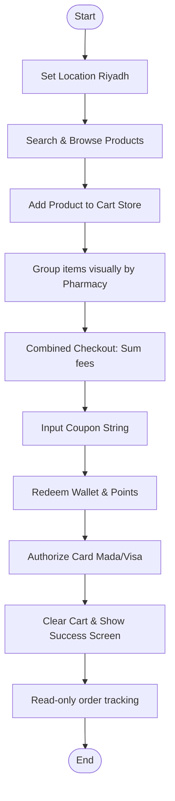

# Gap & Alignment Analysis: Frontend vs. Business Flowchart

This document compares the **actual frontend implementation** of the Yusur Consumer Web Application with the **target business workflow flowchart** provided by the business analysis team. It highlights technical alignments, gaps, inconsistencies, and structural deviations.

---

## 1. Executive Summary: Core Inconsistencies

While the frontend successfully implements basic discovery, layout templates, and multi-branch checkout calculations, there are significant structural and logic gaps between the actual code and the target business blueprint:

1.  **Cart Checkout Strategy**:
    *   *Target Flowchart*: Splitting a cart into different branches initiates a separate checkout flow per order (one cart/branch at a time).
    *   *Frontend Actual*: Groups items visually in the cart view, but executes checkout as a single, combined transaction with summed delivery fees.
2.  **Availability & Alternative Substitutes Flow**:
    *   *Target Flowchart*: Implements seller availability checks, presents alternative items when items are unavailable, and prompts the user to accept substitutes or cancel.
    *   *Frontend Actual*: This flow is completely missing. It assumes 100% catalog availability based on frontend stock checks.
3.  **Item Reservation States**:
    *   *Target Flowchart*: Places items on temporary hold (Reservation) prior to triggering payment gate API requests.
    *   *Frontend Actual*: Directly initiates payment authorization without a lock or reservation indicator state.
4.  **Order Cancellations & Refund Preferences**:
    *   *Target Flowchart*: Customers can cancel orders before pickup and select a refund payment path (Wallet vs. Original Payment Method).
    *   *Frontend Actual*: Order tracking views are read-only; no cancellation forms, refund selections, or POS notification bindings exist.

---

## 2. Feature-by-Feature Gap Matrix

| Workflow Phase | Target Business Flowchart Requirement | Actual Frontend Implementation Status | Gap Classification | Technical Action Required |
| :--- | :--- | :--- | :--- | :--- |
| **Authentication & Location** | Authenticate user, verify and save address. | Checked and verified via `useAuthStore` and `useLocationStore`. | **Aligned** | None. |
| **Catalog Promotion Rules** | Apply item-level and cart-level discount rules. | Static price comparisons (`price` vs `originalPrice`) and mockup coupon inputs. No rules engine integration. | **Partial Alignment** | Connect the coupon input value to a promo service API validation response. |
| **Multi-Branch Cart Split** | Create a separate cart per branch and execute checkout for each as separate orders. | Combines items into one cart array, calculating a combined checkout subtotal and placing one combined order. | **Structural Mismatch** | Redesign checkout router segments to isolate checkout requests by `pharmacyId`. |
| **Voucher / Gift Card Validation** | Prompt for Voucher/Gift Card, validate via Promo Service, show invalid warnings. | Displays coupon input. No voucher/gift card selection or validation handlers. | **Missing Feature** | Add input fields and API hooks for voucher validations. |
| **Fulfillment Checks & Alternatives** | Query seller availability. If unavailable, query alternatives, present substitutes, and capture user choice. | Fully mocked; catalog inventory checks are static. No UI or routing exists for substitutes. | **Critical Gap** | Build alternative suggestion cards and integrate web socket listeners for seller confirmations. |
| **Pre-Payment Reservation** | Reserve items on the seller side before charging the customer's card. | Direct checkout submission without a reservation status wrapper. | **Missing Flow** | Add a pre-checkout reservation step and show an item lock countdown timer. |
| **POS API Confirmation** | Update local Pharmacy POS system upon successful payment. | Simulated redirect to success route page upon client validation. | **System Gap** | Backend handles integration; frontend needs to display loading indicators during POS validation. |
| **Cancellation & Refund Routing** | Customer cancels before pickup, choosing to refund to Wallet or original card. | No cancellation trigger button exists in orders or tracking views. | **Critical Gap** | Add a "Cancel Order" button in tracking screens and display a refund preferences form. |

---

## 3. Comparative Flow Mapping

### Current Frontend Flow (Actual Code)

### Business Target Workflow (Flowchart Requirement)

```mermaid
flowchart TD
    Start([Start]) --> Auth[Authenticate]
    Auth --> Loc[Confirm Location]
    Loc --> Catalog[Browse Deals & Products]
    Catalog --> ItemRule{Rule Engine: Item Promo?}
    ItemRule -- Yes --> ApplyItem[Apply Item Promo Discount] --> SplitCheck
    ItemRule -- No --> SplitCheck{Items from Multiple Branches?}
    
    SplitCheck -- Yes --> BranchCart[Create Separate Cart per Branch] --> SelectedCheck[Initiate Checkout on Selected Cart Only]
    SplitCheck -- No --> SingleCart[Regular Checkout] --> SelectedCheck
    
    SelectedCheck --> CartRule{Rule Engine: Cart Promo?}
    CartRule -- Yes --> ApplyCart[Apply Free Delivery/Cart Promo] --> VoucherPrompt
    CartRule -- No --> VoucherPrompt[Prompt: Code or Gift Card?]
    
    VoucherPrompt --> CheckVoucher{Code Entered?}
    CheckVoucher -- Yes --> ValidateCode[Validate via Promo API] --> CodeValid{Is Valid?}
    CodeValid -- Yes --> ApplyCode[Deduct Discount] --> QueryStock
    CodeValid -- No --> NotifyCode[Show Invalid Code Toast] --> RecheckCode[Try Another Code?]
    RecheckCode -- Yes --> CheckVoucher
    RecheckCode -- No --> QueryStock
    CheckVoucher -- No --> QueryStock
    
    QueryStock[Marketplace: Request Items Availability] --> SellerStock{All Items Available?}
    SellerStock -- No --> QueryAlternatives[Fetch Alternative Items] --> AltsFound{Alternatives Found?}
    AltsFound -- Yes --> PresentAlts[Present Alternatives to User] --> UserChoice{User Choice}
    UserChoice -- Cancel --> CancelOrder[Cancel & End]
    UserChoice -- Continue --> ReserveItems[Request Reserve Items]
    AltsFound -- No --> ReserveItems
    SellerStock -- Yes --> ReserveItems
    
    ReserveItems --> PayGate[Proceed to Payment Gateway]
    PayGate --> PayStatus{Payment Successful?}
    PayStatus -- No --> CancelRes[Cancel Reservation & Notify] --> CancelOrder
    PayStatus -- Yes --> ConfirmPOS[Confirm Order with POS API] --> CancelCheck{Cancel Before Pickup?}
    
    CancelCheck -- Yes --> ChooseRefund[Choose Refund Type: Wallet vs Card] --> RefundOrder[Process Refund & Update Status] --> End([End])
    CancelCheck -- No --> ETA[Send Confirmation & ETA] --> Tracking[Delivery Updates & Tracking] --> End
```

---

## 4. Specific Action Items & Recommendations

### Action Item 1: Restructuring Cart & Checkout Routing (Multi-Branch Split)
To resolve the cart split strategy difference, the frontend should transition from a combined checkout model to a branch-focused checkout route structure:
*   Instead of routing `/checkout` for all cart contents, route to `/checkout?branch=[pharmacyId]`.
*   Maintain the primary items list inside `useCartStore`, but pass branch filters during checkout to process orders individually.

### Action Item 2: Build the Real-Time Alternatives Presenter UI
To cover the missing item availability and alternative items flow, the frontend needs to handle stock discrepancies dynamically:
*   Create a new route or modal view: `/orders/[id]/alternatives`.
*   Map and render alternative items, highlighting variations in brand, price, and reviews.
*   Provide action selections:
    1.  `Accept Substitute`: Replace the unavailable item with the selected alternative.
    2.  `Remove & Continue`: Remove the item and proceed with checkout calculations.
    3.  `Cancel Order`: Decline replacements and cancel the transaction.

### Action Item 3: Add Cancellation and Refund Selection Screens
To support pre-pickup cancellation requests:
*   Add a "Cancel Order" button in [order-detail-page.tsx](file:///c:/Users/IBRAHIM/Documents/Marketplace_v3/src/components/pages/order-detail-page.tsx) that displays if the status is `pending` or `confirmed`.
*   Create a cancellation dialog prompting for the refund method:
    *   Radio Option 1: `Refund to Wallet` (instant credit).
    *   Radio Option 2: `Refund to original payment method` (requires 5-7 business days).
*   Add a cancellation feedback form to capture customer cancellation reasons.
