# Yusur Healthcare Marketplace - Enterprise Solution Architecture
## Reverse Engineering & System Workflows

This document provides a comprehensive, production-grade reverse-engineered solution architecture of the **Yusur Healthcare Marketplace** Consumer Web Application. It outlines the frontend mechanics, business workflows, state management, validations, and API communication patterns derived directly from the Next.js and Zustand implementation.

---

## Architectural & System Design Review

### 1. Folder Structure & Technology Stack
*   **Framework**: Next.js 15 (App Router, localized pathing under `src/app/[locale]`).
*   **Language**: TypeScript for type-safety.
*   **Styling**: Tailwind CSS 4.x, class variance authority (`cva`), and custom CSS utility wrappers.
*   **State Management**: Zustand (persisted state stored in browser LocalStorage under specific prefixes).
*   **Forms & Validation**: React Hook Form with Zod schemas.
*   **Localization**: `next-intl` wrapping core routing utilities (`Link`, `redirect`, `usePathname`, `useRouter`) for English (`en`) and Arabic (`ar`) locales.
*   **Data Querying**: `@tanstack/react-query` ready structure.

### 2. Component Design & Code Organization
The application separates layout wrappers, page-level controllers, and shared domain-specific widgets:
*   `src/components/layout`: Contains shell wrappers, headers, footers, and profile sidebars that handle global state like cart item indicators, current location display, and session metadata.
*   `src/components/pages`: Single-responsibility client page controllers (e.g., `checkout-page.tsx`, `cart-page.tsx`, `login-page.tsx`) mapping to dynamic route modules.
*   `src/components/marketplace`: Domain-specific components (e.g., `product-card.tsx`, `pharmacy-card.tsx`, `order-summary.tsx`, `location-selector.tsx`).
*   `src/stores`: Zustand global slices mapping directly to distinct LocalStorage keys:
    *   `yusur-auth` (Credentials & Session state)
    *   `yusur-cart` (Quantities, applied discounts, wallet & points redemptions)
    *   `yusur-location` (Delivery city & district)
    *   `yusur-recently-viewed` (Max 12 products list)
    *   `yusur-wishlist` (Favorites tracking array)

---

## Feature-by-Feature Systems Analysis

### Feature 1: Authentication & Onboarding (Login, Register, OTP, Forgot Password)

#### 1. Functional Analysis
The authentication system secures client-side user sessions, processes new registrations, triggers mobile-based validation via OTP, and resets passwords for existing users.
*   **Purpose**: Register and verify user credentials via mobile phone and enforce session persistence.
*   **User Goal**: Sign up securely, verify phone via OTP, log in to access wallet balances and loyalty tier programs.
*   **Business Goal**: Maintain verified user profiles, prevent bot accounts, enforce Saudi mobile format standard rules, and link transactions to unique customer IDs.
*   **Entry Points**: 
    *   Header "Login" button.
    *   Redirect from checkout if the cart has items but the session is authenticated as false.
    *   Redirect from the profile page if accessed directly by an anonymous user.
*   **Exit Points**: Redirects to the homepage (`/`) or the originating checkout route upon successful token storage.

#### 2. Technical Analysis
*   **File Context**: 
    *   [login-page.tsx](file:///c:/Users/IBRAHIM/Documents/Marketplace_v3/src/components/pages/login-page.tsx)
    *   [register-page.tsx](file:///c:/Users/IBRAHIM/Documents/Marketplace_v3/src/components/pages/register-page.tsx)
    *   [otp-page.tsx](file:///c:/Users/IBRAHIM/Documents/Marketplace_v3/src/components/pages/otp-page.tsx)
    *   [forgot-password-page.tsx](file:///c:/Users/IBRAHIM/Documents/Marketplace_v3/src/components/pages/forgot-password-page.tsx)
    *   [auth.ts Schema](file:///c:/Users/IBRAHIM/Documents/Marketplace_v3/src/lib/validations/auth.ts)
    *   [auth-store.ts](file:///c:/Users/IBRAHIM/Documents/Marketplace_v3/src/stores/auth-store.ts)
*   **Validation Rules**: 
    *   Phone number must start with `5` and be exactly 9 digits: `/^5\d{8}$/` (Zod `regex`).
    *   Password must be at least 6 characters.
    *   Confirm Password must match Password on registration.
    *   `acceptTerms` must be boolean `true`.
    *   OTP verification code must be exactly 6 characters.
*   **State Management**: `useAuthStore` stores the active `User` object (consisting of `id`, `name`, `email`, `phone`) and `isAuthenticated` boolean. Session is persisted via `persist` middleware inside LocalStorage key `yusur-auth`.

#### 3. Business Analysis
*   **Saudi Mobile Standard**: Restricts input registration strictly to Saudi mobile prefixes, ensuring SMS delivery logic and integration with local telecommunications remains uniform.
*   **Terms and Conditions Enforcement**: Legally complies with national e-commerce regulations requiring explicit user consent prior to profile setup.

#### 4. Mermaid Flowchart
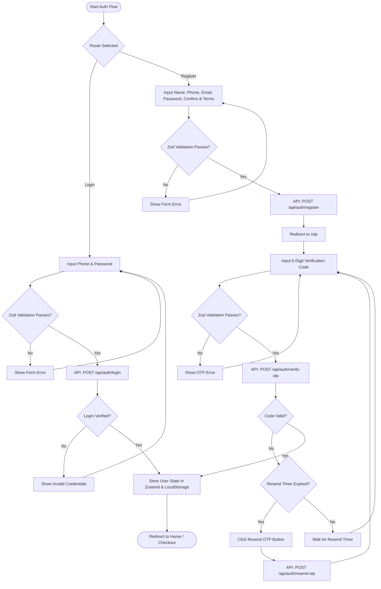

#### 5. Frontend Responsibilities
*   Intercept form submissions and run Zod validation client-side before fetching.
*   Display error messages contextual to the specific input field.
*   Manage OTP countdown timer state (starts at 60 seconds) and toggle resend button availability.

#### 6. Backend Responsibilities
*   Provide secure POST endpoints for credentials processing, OTP generation, and validation.
*   Format mobile payload standard (inject `+966` country code) and interface with SMS gateway.
*   Issue signed JSON Web Tokens (JWT) upon successful verification.

#### 7. API Sequence
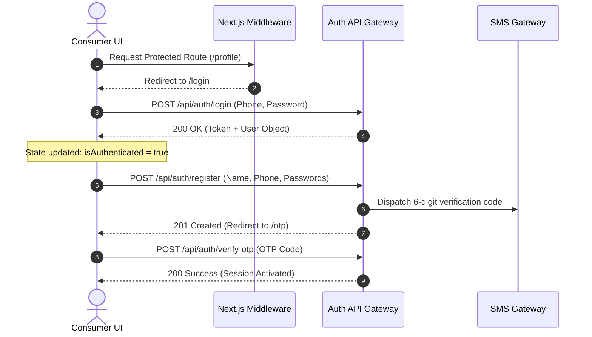

#### 8. Missing Scenarios
*   Social Sign-In OAuth (Google, Apple, Single Sign-On).
*   Password strength criteria visualization (uppercase, numbers, symbols) in UI.

#### 9. Risks
*   *Security vulnerability*: Client-side JWT session checking without synchronous cookie-level server-side validation can lead to unauthorized route access if local storage is compromised.

#### 10. Improvement Suggestions
*   Implement NextJS server actions and secure HttpOnly cookies for session state tokens instead of localStorage to prevent Cross-Site Scripting (XSS) tokens harvesting.

---

### Feature 2: Splash & Home Page (Discovery & Location Selector)

#### 1. Functional Analysis
Acts as the consumer storefront landing path. Renders marketing banners, categories mega menus, pharmacy branches listings, and featured products catalog. Allows geographic setting selection.
*   **Purpose**: Guide user search query directions and set the local delivery location.
*   **User Goal**: Find promotions, locate open branches near them, and search for specific health items.
*   **Business Goal**: Boost product discoverability, drive conversions using promo banners, and filter stores by delivery constraints.
*   **Entry Points**: Root URL `/` or `/search`.
*   **Exit Points**: Category listings, Pharmacy details, search results.

#### 2. Technical Analysis
*   **File Context**: 
    *   [home-page.tsx](file:///c:/Users/IBRAHIM/Documents/Marketplace_v3/src/components/pages/home-page.tsx)
    *   [site-header.tsx](file:///c:/Users/IBRAHIM/Documents/Marketplace_v3/src/components/layout/site-header.tsx)
    *   [location-selector.tsx](file:///c:/Users/IBRAHIM/Documents/Marketplace_v3/src/components/marketplace/location-selector.tsx)
    *   [location-store.ts](file:///c:/Users/IBRAHIM/Documents/Marketplace_v3/src/stores/location-store.ts)
*   **State Management**: `useLocationStore` stores global `city` and `district` coordinates. Resolves default values to `Riyadh` and `Al Olaya` if empty. LocalStorage key: `yusur-location`.
*   **Carousel Componentry**: Embla Carousel wraps featured lists. Banners display active slider dots matching selected index keys.

#### 3. Business Analysis
*   **Contextual Delivery Logic**: The home page highlights delivery ETAs and fees corresponding directly to the geographic proximity set inside the location selector state.
*   **Marketing Conversions**: Dynamic banners encourage targeted category browsing (e.g. 20% discount on Vitamins).

#### 4. Mermaid Flowchart
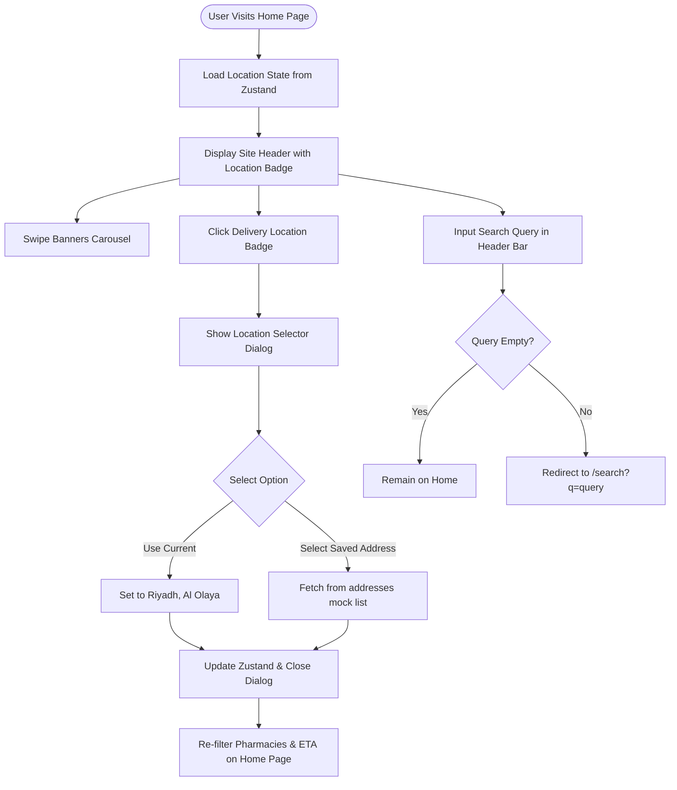

#### 5. Frontend Responsibilities
*   Retrieve client browser coordinates or address values to filter store models.
*   Store geographic variables globally.
*   Manage carousel slide timers and active hero states.

#### 6. Backend Responsibilities
*   Expose endpoints querying active banners and listing open branches matching the specified location.
*   Provide geo-reverse coordinates resolver.

#### 7. API Sequence
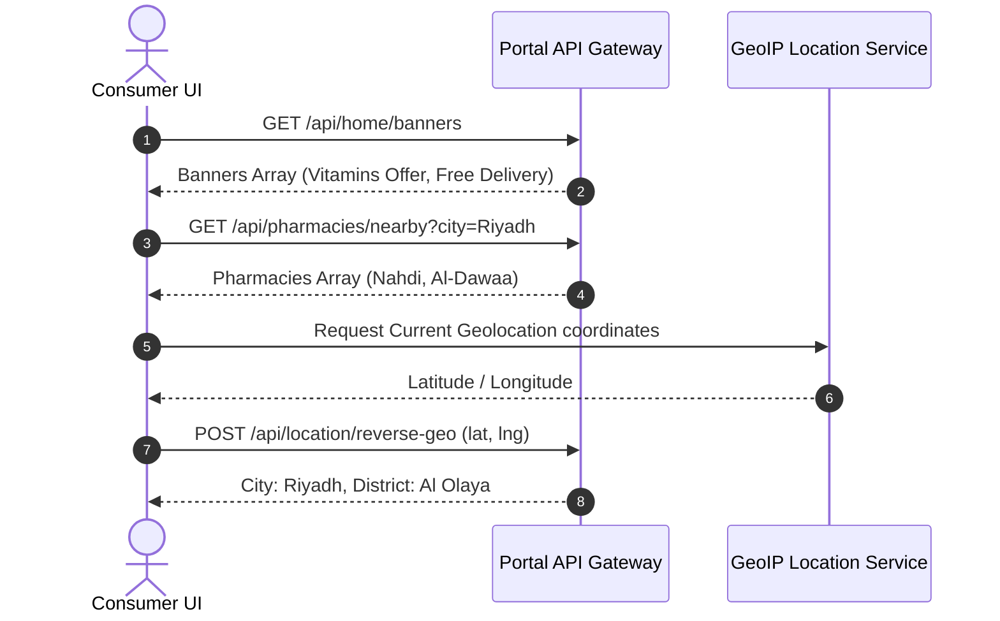

#### 8. Missing Scenarios
*   Automatic prompt requesting geolocation permission on the first page paint.
*   Filter pharmacies by specific categories or delivery types (e.g., standard vs. express).

#### 9. Risks
*   *Display mismatch*: Inaccurate location estimation leads to displaying branches that cannot deliver to the physical address.

#### 10. Improvement Suggestions
*   Integrate Google Maps Javascript API inside `location-selector.tsx` to allow precise pin placements.

---

### Feature 3: Catalog Discovery (Categories, Search, Product Details, Variants, Offers)

#### 1. Functional Analysis
Enables catalog navigation through structured categories, global query search, sorting mechanisms, and product detail viewing.
*   **Purpose**: Display product specifications, prices, stock counts, prescription requirements, and related items.
*   **User Goal**: Search for a brand, inspect if a medicine requires an Rx certificate, and check item details.
*   **Business Goal**: Support brand compliance, enforce prescription warning banners, showcase discounts, and cross-sell using category recommendation widgets.
*   **Entry Points**: `/categories`, `/search?q=...`, `/products/[slug]`.
*   **Exit Points**: Cart page, checkout details page.

#### 2. Technical Analysis
*   **File Context**: 
    *   [categories-page.tsx](file:///c:/Users/IBRAHIM/Documents/Marketplace_v3/src/components/pages/categories-page.tsx)
    *   [products-page.tsx](file:///c:/Users/IBRAHIM/Documents/Marketplace_v3/src/components/pages/products-page.tsx)
    *   [search-page.tsx](file:///c:/Users/IBRAHIM/Documents/Marketplace_v3/src/components/pages/search-page.tsx)
    *   [product-detail-page.tsx](file:///c:/Users/IBRAHIM/Documents/Marketplace_v3/src/components/pages/product-detail-page.tsx)
    *   [recently-viewed-store.ts](file:///c:/Users/IBRAHIM/Documents/Marketplace_v3/src/stores/recently-viewed-store.ts)
*   **Business Rules**:
    *   Prescription Verification: If `product.requiresPrescription` is `true`, a warning badge is displayed and the user is prompted to upload a prescription during checkout.
    *   Inventory validation: Check `product.inStock`. If `false`, display "Out of Stock" overlay and disable checkout additions.
    *   Search filter: Search query checks both product name and brand fields.
    *   Recently viewed logic: Appends viewed item to the top of the array, limits array to 12 items, and avoids duplicates. LocalStorage key: `yusur-recently-viewed`.

#### 3. Business Analysis
*   **Fulfillment Guardrails**: Strict inventory tracking stops transactions on out-of-stock items, preventing fulfillment backlog.
*   **Prescription Controls (Rx)**: Restricting prescription delivery helps satisfy pharmaceutical safety compliance guidelines in Saudi Arabia.

#### 4. Mermaid Flowchart
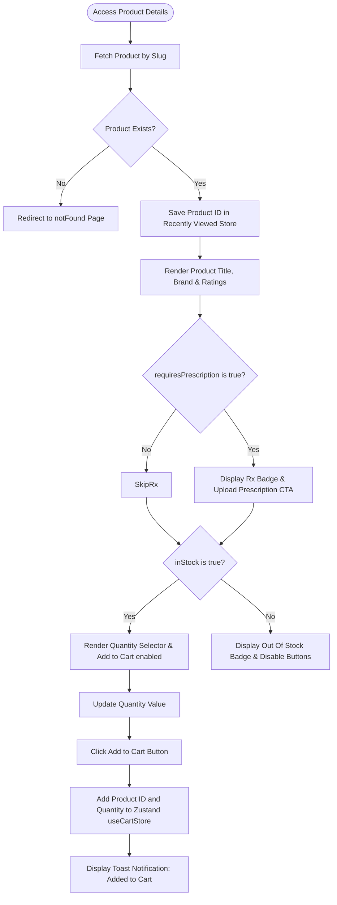

#### 5. Frontend Responsibilities
*   Render localized fields (`nameAr` vs `name`) based on active locale configuration.
*   Enforce quantity steppers constraints (minimum 1, maximum `stockCount`).
*   Manage product tabs (Description, How to Use, Ingredients).

#### 6. Backend Responsibilities
*   Manage centralized catalog database index supporting high-frequency fuzzy search.
*   Process prescription file uploads and associate metadata to temporary sessions.

#### 7. API Sequence
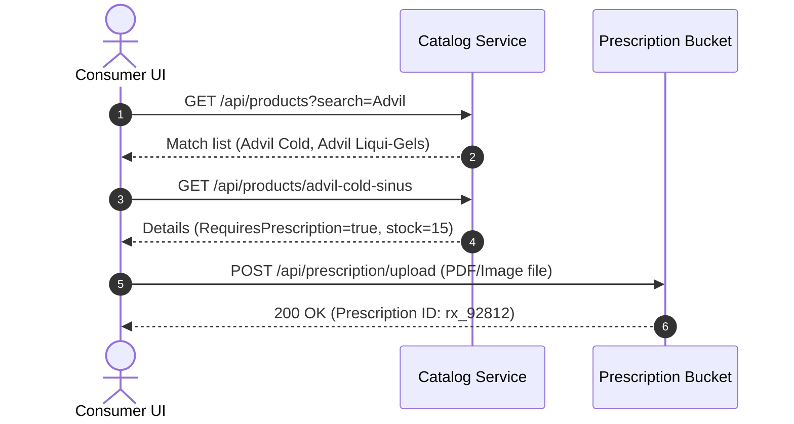

#### 8. Missing Scenarios
*   Review submissions and ratings interface on product details view.
*   Price range sliders filtering catalog listings on search results.

#### 9. Risks
*   *Stock Discrepancy*: Stock count discrepancies between cached client catalog lists and live stock databases can result in card declines or order cancellations during backend processing.

#### 10. Improvement Suggestions
*   Implement real-time stock sync via WebSockets or optimistic locking API checks on product detail view.

---

### Feature 4: Cart Management & Multi-Branch Logic

#### 1. Functional Analysis
Accumulates items selected for purchase, adjusts item quantities, and groups lines by pharmacy branch.
*   **Purpose**: Manage purchase cart items, calculate delivery costs, and divide orders by pharmacy branches.
*   **User Goal**: Update quantities, delete items, view estimated delivery times, and see delivery fee breakdowns.
*   **Business Goal**: Support multi-partner transactions, calculate delivery charges per pharmacy, and prepare orders for split checkout processing.
*   **Entry Points**: Header cart link or Mobile bottom navigation `/cart`.
*   **Exit Points**: Redirects back to `/products` catalog or forwards to `/checkout`.

#### 2. Technical Analysis
*   **File Context**: 
    *   [cart-page.tsx](file:///c:/Users/IBRAHIM/Documents/Marketplace_v3/src/components/pages/cart-page.tsx)
    *   [cart-store.ts](file:///c:/Users/IBRAHIM/Documents/Marketplace_v3/src/stores/cart-store.ts)
    *   [order-summary.tsx](file:///c:/Users/IBRAHIM/Documents/Marketplace_v3/src/components/marketplace/order-summary.tsx)
*   **Zustand Store Actions**:
    *   `addItem(productId, quantity)`: Appends line or updates quantity for existing lines.
    *   `updateQuantity(productId, quantity)`: Modifies line count. If `quantity <= 0`, triggers line deletion.
    *   `removeItem(productId)`: Filters out matching lines.
    *   `clearCart()`: Empties cart array and resets applied coupon, wallet, and points states.
*   **Multi-Branch Pricing Architecture**:
    *   Cart groups items by pharmacy branch:
        ```typescript
        const cartGroups = items.reduce<Record<string, { pharmacyId: string; lines: CartLine[] }>>((acc, item) => { ... })
        ```
    *   Subtotal represents the sum of product prices multiplied by their quantities.
    *   Delivery fee represents the sum of the delivery fees of each pharmacy branch:
        ```typescript
        const deliveryFees = groups.reduce((sum, group) => sum + (getPharmacyById(group.pharmacyId)?.deliveryFee ?? 0), 0);
        ```

#### 3. Business Analysis
*   **Multi-Branch Delivery Fee Rules**: If a customer builds a cart containing items from Nahdi Pharmacy (delivery: 0 SAR) and Boots Pharmacy (delivery: 12 SAR), the delivery fee totals 12 SAR. This model handles fulfillment split logic by charging fees matching the shipping overhead of each partner pharmacy.

#### 4. Mermaid Flowchart
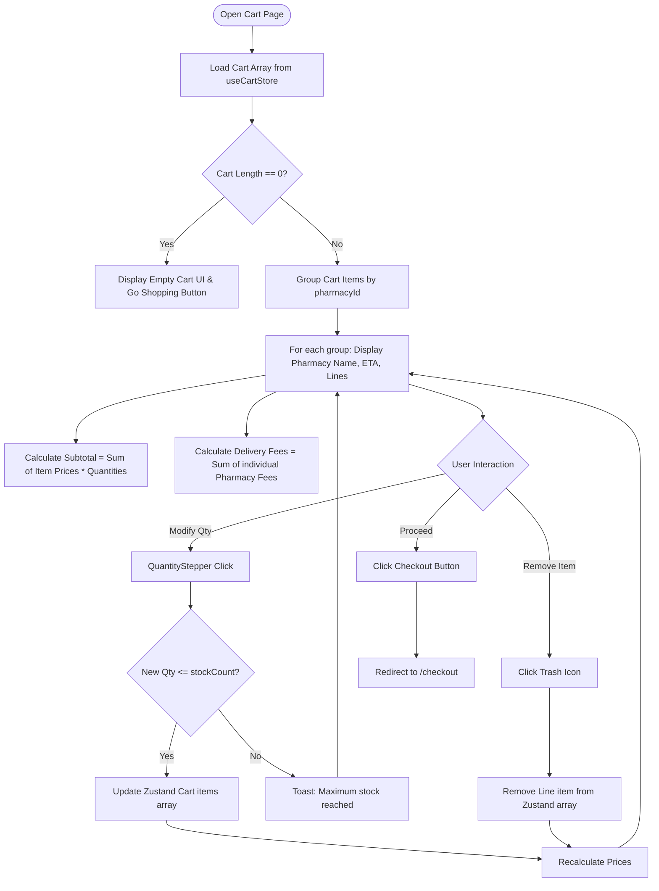

#### 5. Frontend Responsibilities
*   Group items by pharmacy ID.
*   Prevent quantity adjustments that exceed available stock numbers.
*   Render local pricing summary breakdowns (VAT, Subtotal, Delivery).

#### 6. Backend Responsibilities
*   Provide current delivery fee schedules and branch ETA thresholds.
*   Validate coupon eligibility based on checkout subtotal values.

#### 7. API Sequence
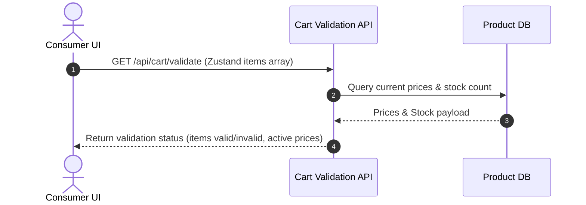

#### 8. Missing Scenarios
*   Branch split alerts clarifying to customers why multiple delivery fees are applied.
*   "Save for later" list moving items out of the checkout cart without deleting them.

#### 9. Risks
*   *Abandoned carts due to checkout fees*: Cumulative delivery charges on orders spanning multiple branches can reduce checkout conversion rates.

#### 10. Improvement Suggestions
*   Highlight alternative products from already selected branches to help customers avoid multiple delivery fees.

---

### Feature 5: Checkout Journey & Promo Systems (Checkout, Delivery Options, Payments, Wallet, Loyalty, Promo Codes)

#### 1. Functional Analysis
Handles address verification, delivery methods configuration, coupon validation, payment input, wallet deductions, loyalty points redemption, and order initialization.
*   **Purpose**: Gather delivery information and process secure payment authorization.
*   **User Goal**: Choose standard/express delivery, apply coupons, redeem loyalty points, choose card payment, and place an order.
*   **Business Goal**: Process card payments, support loyalty point conversions, manage wallet debits, and create order records.
*   **Entry Points**: Cart page "Proceed to Checkout" button or `/checkout` route.
*   **Exit Points**: Successful placement redirecting to `/checkout/success`.

#### 2. Technical Analysis
*   **File Context**: 
    *   [checkout-page.tsx](file:///c:/Users/IBRAHIM/Documents/Marketplace_v3/src/components/pages/checkout-page.tsx)
    *   [checkout-success-page.tsx](file:///c:/Users/IBRAHIM/Documents/Marketplace_v3/src/components/pages/checkout-success-page.tsx)
    *   [order-summary.tsx](file:///c:/Users/IBRAHIM/Documents/Marketplace_v3/src/components/marketplace/order-summary.tsx)
*   **Calculations & Validation Logic**:
    *   **Wallet Integration**:
        `Math.min(WALLET_BALANCE, subtotal)` caps wallet usage to the order's subtotal, preventing negative pricing calculations.
    *   **Loyalty Points Redemption**:
        Points to SAR conversion: `100 points = 1 SAR` (multiplier: `0.01`).
        The slider limit is set to: `Math.min(LOYALTY_POINTS, Math.floor(subtotal / POINTS_TO_SAR))`.
    *   **Total Calculation**:
        `Math.max(0, subtotal + deliveryFees - discount - walletAmount - loyaltyDiscount)` updates dynamically as coupon, wallet, or loyalty adjustments are applied.
    *   **Delivery Types**: Standard Delivery displays the branch's base ETA. Express Delivery reduces the ETA by 10 minutes (with a minimum limit of 15 minutes).

#### 3. Business Analysis
*   **Redemption Guardrails**: Prevents point redemptions that exceed the subtotal, avoiding negative order totals.
*   **Regulatory Compliance (VAT)**: Checkout totals are explicitly documented as VAT-inclusive to satisfy Saudi tax regulations.

#### 4. Mermaid Flowchart
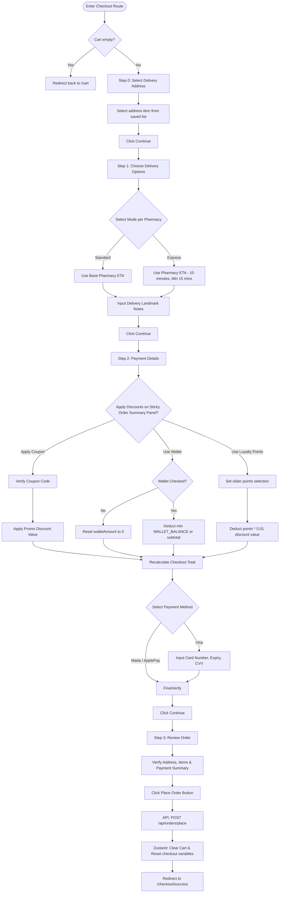

#### 5. Frontend Responsibilities
*   Handle multi-step stepper state navigation transitions.
*   Recalculate cart totals dynamically based on coupon codes, wallet settings, and point redemptions.
*   Sanitize payment fields (enforce numeric-only input on CVV and card numbers).

#### 6. Backend Responsibilities
*   Validate credit balance, coupon codes, and point balances during order processing.
*   Interface with payment gateways (Mada, Apple Pay, Visa) to authorize charges.
*   Create sub-orders for each pharmacy branch if the order contains split shipments.

#### 7. API Sequence
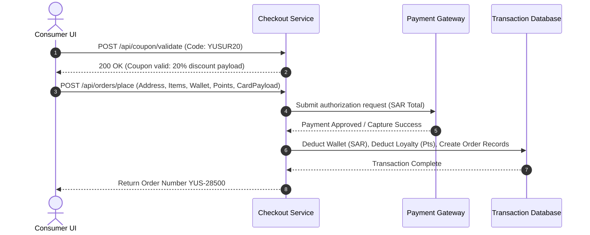

#### 8. Missing Scenarios
*   Insufficient funds handling on wallet toggle selections.
*   Verify CVV input formatting before triggering checkout API queries.

#### 9. Risks
*   *API timeouts during transaction processing*: Payment gateway latency can cause frontend timeouts, resulting in double-charges or orders created without completed payment confirmations.

#### 10. Improvement Suggestions
*   Implement 3D Secure verification iframe handles inside payment selection loops.

---

### Feature 6: Profile & User Account Settings (Wallet logs, Loyalty status, Address management, Wishlist, Settings, Notifications)

#### 1. Functional Analysis
Centralizes customer account configurations. Handles profile information, saved addresses, wallet balance transaction logs, loyalty tiers, product favorites, language preferences, and notifications.
*   **Purpose**: Update profile inputs, verify points transactions, toggle translations, and view alert history.
*   **User Goal**: Edit full name, verify wallet transactions, review wishlist items, check notifications, and toggle dark mode.
*   **Business Goal**: Retain customer engagement, support localization guidelines, and compile diagnostic logs (refunds, loyalty points).
*   **Entry Points**: `/profile`, `/profile/addresses`, `/profile/wallet`, `/profile/loyalty`, `/profile/wishlist`, `/profile/settings`, `/notifications`.
*   **Exit Points**: Redirect to `/login` upon clicking logout.

#### 2. Technical Analysis
*   **File Context**: 
    *   [profile-page.tsx](file:///c:/Users/IBRAHIM/Documents/Marketplace_v3/src/components/pages/profile-page.tsx)
    *   [profile-sidebar.tsx](file:///c:/Users/IBRAHIM/Documents/Marketplace_v3/src/components/layout/profile-sidebar.tsx)
    *   [wallet-page.tsx](file:///c:/Users/IBRAHIM/Documents/Marketplace_v3/src/components/pages/wallet-page.tsx)
    *   [loyalty-page.tsx](file:///c:/Users/IBRAHIM/Documents/Marketplace_v3/src/components/pages/loyalty-page.tsx)
    *   [addresses-page.tsx](file:///c:/Users/IBRAHIM/Documents/Marketplace_v3/src/components/pages/addresses-page.tsx)
    *   [wishlist-page.tsx](file:///c:/Users/IBRAHIM/Documents/Marketplace_v3/src/components/pages/wishlist-page.tsx)
    *   [settings-page.tsx](file:///c:/Users/IBRAHIM/Documents/Marketplace_v3/src/components/pages/settings-page.tsx)
    *   [notifications-page.tsx](file:///c:/Users/IBRAHIM/Documents/Marketplace_v3/src/components/pages/notifications-page.tsx)
    *   [wishlist-store.ts](file:///c:/Users/IBRAHIM/Documents/Marketplace_v3/src/stores/wishlist-store.ts)
*   **Business Rules**:
    *   Language Toggle: Toggles the locale parameter (`en` vs `ar`) and updates route segments accordingly:
        ```typescript
        router.replace(pathname, { locale: locale === "en" ? "ar" : "en" });
        ```
    *   Loyalty Tier Progress: Shows points balance (e.g. 2,400 pts) and displays the points required for the next tier (e.g., Gold).
    *   Wishlist toggle: Adds or removes items from the wishlist store, displaying active hearts on product cards:
        ```typescript
        toggleItem: (productId) => { ... }
        ```

#### 3. Business Analysis
*   **Customer Loyalty Tiering**: Visual tier progress indicators motivate repeat purchases to unlock Gold tier benefits.
*   **National Privacy Regulation Compliance (PDPL)**: Profile pages allow users to inspect stored phone number and email data, satisfying transparency guidelines.

#### 4. Mermaid Flowchart
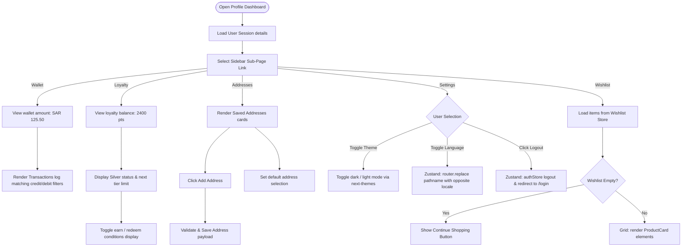

#### 5. Frontend Responsibilities
*   Render corresponding visual components based on active theme setting (dark/light mode).
*   Sync locale settings instantly across translation contexts when changed.
*   Persist wishlist state array locally.

#### 6. Backend Responsibilities
*   Provide secure profile update endpoints.
*   Track wallet balance adjustments and log transactional modifications (refunds vs checkouts).

#### 7. API Sequence
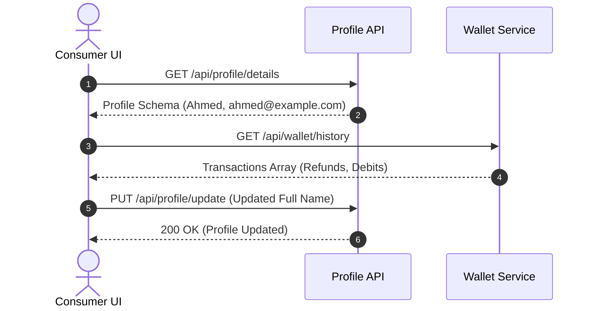

#### 8. Missing Scenarios
*   Verification checks on new email or phone inputs.
*   Interactive maps for selecting address delivery pin points.

#### 9. Risks
*   *Address Selection Discrepancy*: Staved addresses with outdated details can result in shipping errors or delayed deliveries.

#### 10. Improvement Suggestions
*   Implement address lookup search queries using Google Places API inside the address setup page.

---

### Feature 7: Order Fulfillment & Tracking (Orders list, Order Detail, Tracking Status, Shipments)

#### 1. Functional Analysis
Renders active and historical order lists, monitors delivery milestones, and displays shipment information for each pharmacy branch.
*   **Purpose**: Display order statuses and list delivery stages.
*   **User Goal**: Track delivery progress, verify order details, and see estimated times of arrival.
*   **Business Goal**: Reduce customer service queries (WISMO) and track delivery ETAs across partner pharmacies.
*   **Entry Points**: `/orders`, `/orders/[id]`.
*   **Exit Points**: Navigate back to products list.

#### 2. Technical Analysis
*   **File Context**: 
    *   [orders-page.tsx](file:///c:/Users/IBRAHIM/Documents/Marketplace_v3/src/components/pages/orders-page.tsx)
    *   [order-detail-page.tsx](file:///c:/Users/IBRAHIM/Documents/Marketplace_v3/src/components/pages/order-detail-page.tsx)
*   **Tracking Status Step Model**:
    ```typescript
    const timelineSteps = ["pending", "confirmed", "preparing", "shipped", "delivered"] as const;
    ```
    The tracking index is resolved using:
    ```typescript
    const currentStepIndex = timelineSteps.indexOf(order.status);
    ```
    The UI renders checkmarks for completed steps (`i <= currentStepIndex`) and highlights the current status.
*   **Multi-Branch Shipments Display**:
    If an order spans multiple branches (`order.pharmacyIds`), the detail view renders a shipment card for each branch, detailing their respective delivery ETAs.

#### 3. Business Analysis
*   **Fulfillment Tracking Transparency**: Breaking down tracking by pharmacy branch clarifies delivery expectations if items ship from multiple locations.

#### 4. Mermaid Flowchart
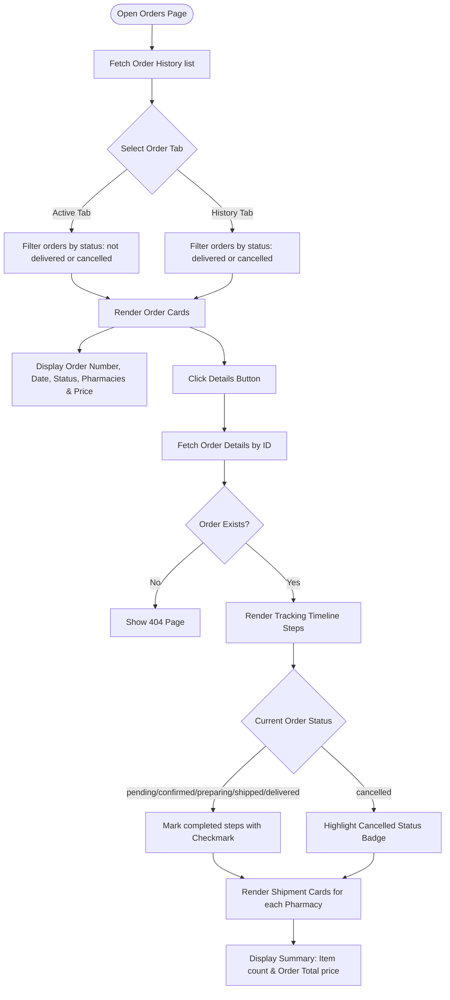

#### 5. Frontend Responsibilities
*   Update delivery status milestones based on order tracking values.
*   Group multi-branch shipments in the order details interface.
*   Render local dates matching user locale configurations.

#### 6. Backend Responsibilities
*   Expose webhook listeners to process updates from courier partner APIs.
*   Expose endpoints querying order history and status details.

#### 7. API Sequence
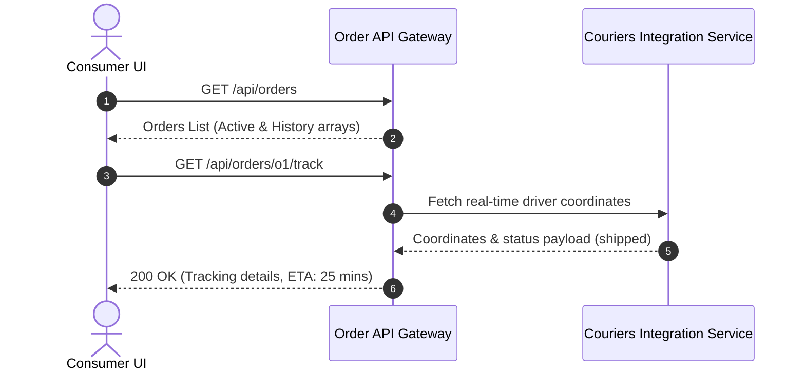

#### 8. Missing Scenarios
*   Cancellation triggers inside the UI for orders that are still pending.
*   In-app returns portal for eligible products.

#### 9. Risks
*   *Delayed Tracking Updates*: Inaccurate courier APIs or delayed status updates can cause confusion regarding order deliveries.

#### 10. Improvement Suggestions
*   Integrate Leaflet or Google Map rendering screens to display live driver locations on active deliveries.

---

### Feature 8: System Error Handling & Quality Safeguards (Not Found & Fallbacks)

#### 1. Functional Analysis
Protects user experiences during application errors, routing faults, or page-not-found events.
*   **Purpose**: Display user-friendly error views, prevent blank screens, and provide redirection links.
*   **User Goal**: Return to a functional route (e.g. Home) after encountering a broken path.
*   **Business Goal**: Protect brand image and retain users on functional paths.
*   **Entry Points**: Dynamic route exceptions, broken links, unauthorized path entries.
*   **Exit Points**: Go to Home Page button redirects.

#### 2. Technical Analysis
*   **File Context**: 
    *   [not-found.tsx](file:///c:/Users/IBRAHIM/Documents/Marketplace_v3/src/app/not-found.tsx)
*   **Fallback Rendering**:
    Static HTML layout displaying "404 - Page Not Found" warning alongside navigation controls linking to `/en` or `/ar`.

#### 3. Business Analysis
*   **Bounce Rate Prevention**: Providing clear redirection options on error pages helps retain users on the platform.

#### 4. Mermaid Flowchart
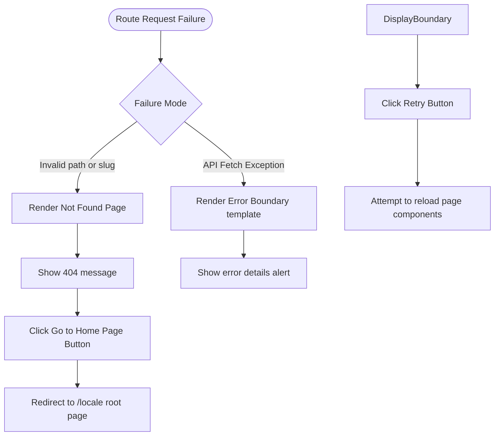

#### 5. Frontend Responsibilities
*   Intercept dynamic exceptions using error boundary layers.
*   Provide localized navigation links on fallback screens.

#### 6. Backend Responsibilities
*   Log routing exceptions and database errors to aid diagnostic debugging.

#### 7. API Sequence
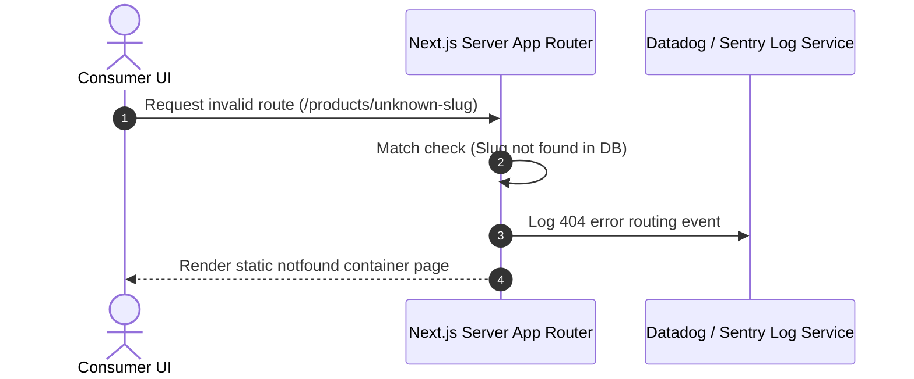

#### 8. Missing Scenarios
*   Custom error components displaying specific errors (e.g., network timeout vs server failure).

#### 9. Risks
*   *Vague error states*: Poorly configured boundaries can expose system details or technical error logs in client views.

#### 10. Improvement Suggestions
*   Implement custom logging scripts that report client-side page crashes to diagnostic services (e.g., Sentry).

---

## Overall Enterprise Solutions Flow

The diagram below maps the complete user lifecycle from onboarding and product discovery through cart, checkout, payment adjustments, and order tracking.

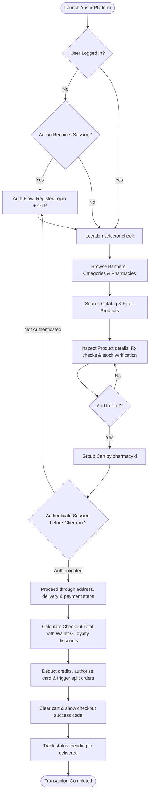

---

## Solution Comparison Table

| Feature Area | Frontend Responsibility | Zustand Store / Persisted Keys | Key API Endpoints Called | Success Scenario | Failure Scenario |
| :--- | :--- | :--- | :--- | :--- | :--- |
| **Authentication** | Validate phone number formats and match passwords client-side. | `useAuthStore` / `yusur-auth` | `POST /api/auth/login`<br>`POST /api/auth/verify-otp` | Session token stored; redirected to home page. | Validation errors displayed; login button disabled. |
| **Discovery** | Manage carousel slider indexes and search form queries. | `useRecentlyViewedStore` / `yusur-recently-viewed` | `GET /api/home/banners`<br>`GET /api/pharmacies/nearby` | Filtered pharmacy lists displayed matching location settings. | Network error fallbacks displayed. |
| **Product Detail** | Enforce stock limits and handle prescription alerts. | `useWishlistStore` / `yusur-wishlist` | `GET /api/products/[slug]` | Product details displayed and add-to-cart button enabled. | "Out of Stock" warning shown; order inputs disabled. |
| **Cart** | Group products by pharmacy branch. | `useCartStore` / `yusur-cart` | `GET /api/cart/validate` | Items grouped with correct delivery fees and ETAs. | Empty cart message shown. |
| **Checkout** | Calculate coupon, wallet, and points discount deductions. | `useCartStore` / `yusur-cart` | `POST /api/orders/place` | Order placed and redirect to success screen. | Payment failure notification shown. |
| **Profile** | Handle localization variables and account forms. | `useAuthStore` / `yusur-auth` | `PUT /api/profile/update` | Profile fields updated and stored. | Form validation errors highlighted. |
| **Order Tracking** | Display delivery status progress milestones. | N/A | `GET /api/orders/[id]/track` | Real-time shipment status and ETA updates shown. | Not Found page displayed if ID is invalid. |
